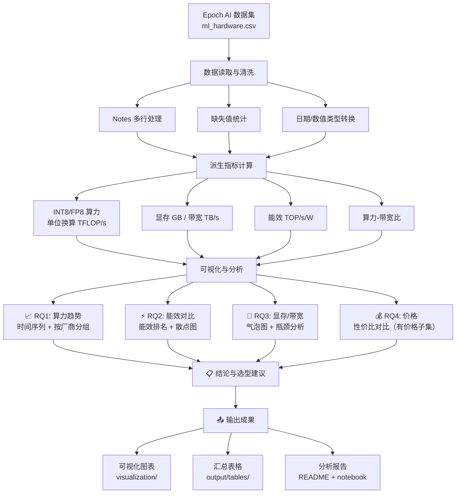
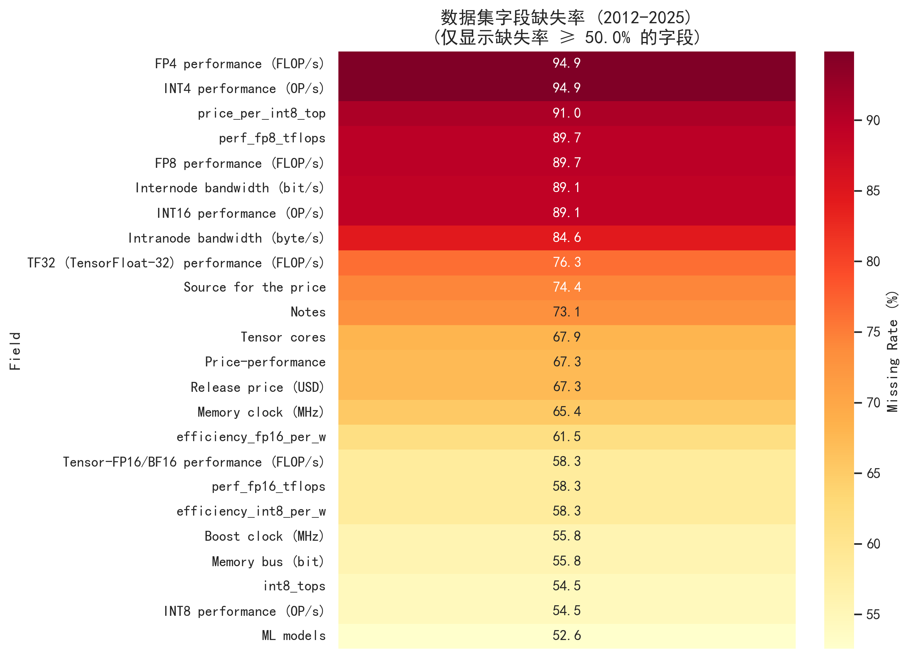
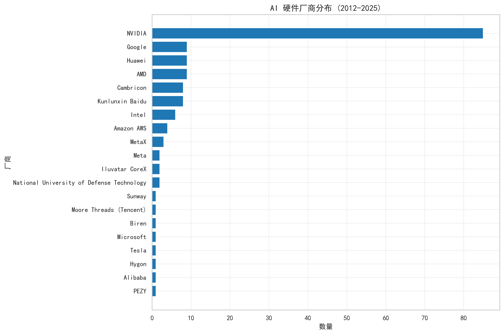
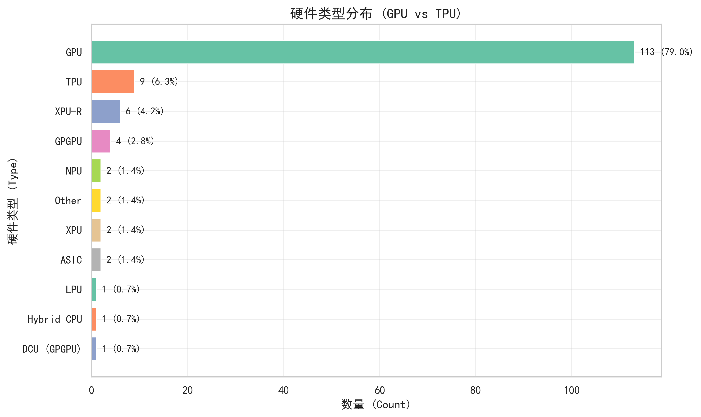
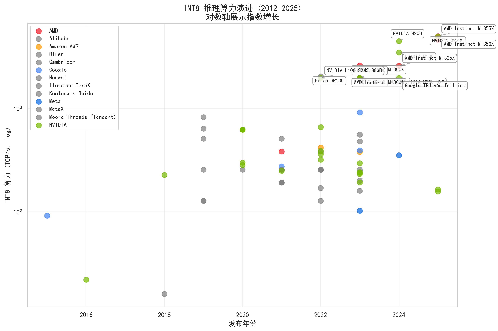
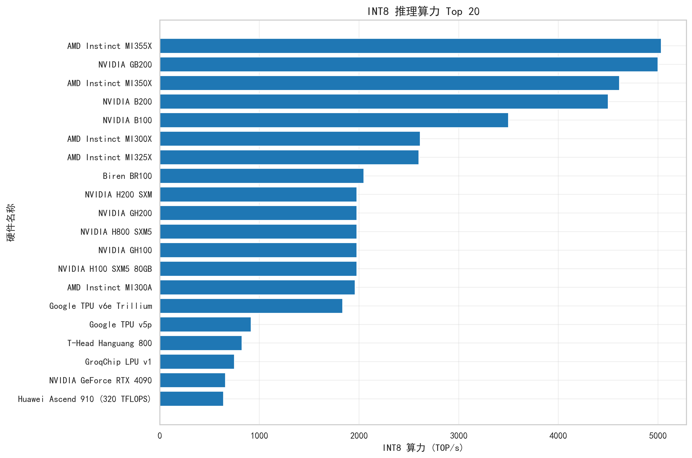
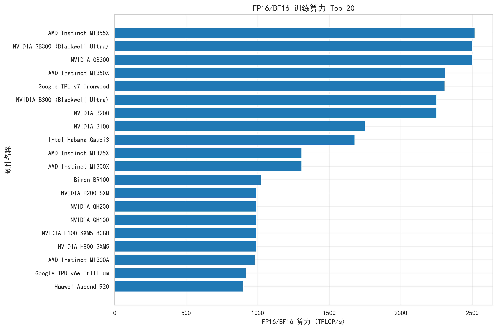
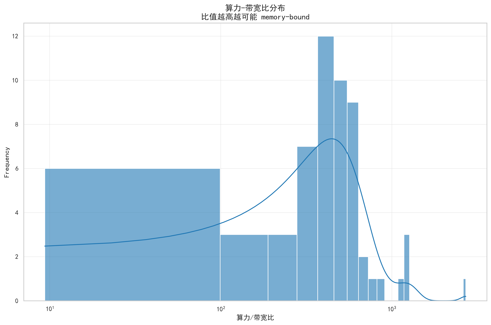

# AI 硬件算力演进分析（ML Hardware Performance Analysis）

<p align="center">
  
  <br/>
  <br/>
</p>

<p align="center">
    <a href="https://github.com/HIT-JimmyXiao/AI_hardware_performerance_data_analysis"></a>
    <a href="https://epoch.ai/data/machine-learning-hardware"></a>
    <a href="https://creativecommons.org/licenses/by/4.0/"></a>
    <a href="https://www.python.org/"></a>
</p>

<h4 align="center">
    <p>
        <a href="https://github.com/HIT-JimmyXiao/AI_hardware_performerance_data_analysis/blob/main/README_EN.md">English</a> |
        <b>简体中文</b>
    </p>
</h4>


---

## 📋 项目简介

> **📦 项目已开源**：本项目已开源至 [GitHub](https://github.com/HIT-JimmyXiao/AI_hardware_performerance_data_analysis)，欢迎 Star ⭐ 和 Fork！

本项目基于 **Epoch AI** 公开发布的 **Machine Learning Hardware 数据集**==（170+ GPU/TPU 规格数据）==，对 **2007-2025 年 AI 硬件算力演进**进行系统性分析,重点关注：

🎯 **推理场景**下的 **INT8/FP8 算力趋势**  
⚡ **能效对比**（算力/功耗）与数据中心成本  
🧠 **显存/带宽匹配**与性能瓶颈分析  
💰 **价格-性能比**（限有价格硬件）  
📊 **训练 vs 推理**硬件选型建议  

**为什么要分析 AI 硬件？**

- 📊  **项目驱动**：项目需求，最近在做姿态提取的CV项目，在考虑租借高性能算力服务器
- 🤖 **AI 大模型的崛起**：ChatGPT/GPT-5/Llama 等大模型的训练与推理都依赖强大的硬件算力
- 💰 **数据中心成本**：算力、功耗、显存是数据中心选型的核心指标
- 📈 **硬件创新速度**：AI 芯片的迭代速度远超传统 CPU，了解趋势有助于预测未来


---

## ❓ 核心研究问题

### RQ0: 数据理解与口径统一
- 不同数值格式（FP32/FP16/FP8/INT8）分别用于什么场景？
- 为什么 INT8 算力比 FP32 高出数倍？
- 如何统一对比口径？

### RQ1: 算力随时间的演进
- 2012-2025 年间，推理算力（INT8）增长了多少倍？
- NVIDIA/AMD/Google/Intel/AWS 谁在不同阶段领先？
- 是否存在"代际跳跃"（如 Hopper → Blackwell 架构）？

### RQ2: 能效与功耗约束
- 在 TDP 限制下，谁的推理能效（TOP/s/W）最高？
- 能效提升主要来自制程进步还是架构优化？
- 数据中心选型如何权衡算力与电力成本？

### RQ3: 显存/带宽与算力的"供给匹配"
- 算力增长是否伴随显存/带宽同步增长？
- 是否存在"算力很强但内存瓶颈"的产品？
- 如何识别 memory-bound 风险？

### RQ4: 价格与性价比（限有价格硬件）
- 消费级 GPU 的推理性价比如何？
- 为何数据中心硬件无公开价格？
- 如何避免价格缺失导致的分析偏差？

### RQ5: 结论与选型建议
- 训练/推理两类场景分别推荐哪些硬件？
- 如何根据预算、功耗、显存需求选型？

---

## 📊 数据集信息

### 数据来源
- **来源机构**：[Epoch AI](https://epoch.ai/)（被 OpenAI、DeepMind、多国政府引用的 AI 趋势研究机构）
- **数据集名称**：[Machine Learning Hardware](https://epoch.ai/data/machine-learning-hardware)
- **数据授权**：[CC BY 4.0](https://creativecommons.org/licenses/by/4.0/)（可自由使用，需署名）
- **数据版本**：2025-12-05（持续更新中）

### 数据规模
- **硬件数量**：286 条记录（170+ 不同型号，部分有多版本）
- **字段数量**：36 个（含基础信息、算力、显存、功耗、制程、价格等）
- **时间跨度**：2007-2025 年（按硬件发布日期）
- **厂商覆盖**：NVIDIA、AMD、HUAWEI，Google、Intel、AWS、Meta、Moore Threads、Sunway 等

### 关键字段
| 分类 | 关键字段 | 说明 |
|------|----------|------|
| 算力 | `INT8 performance (OP/s)` | **推理主口径**（本项目重点） |
|  | `Tensor-FP16/BF16 performance (FLOP/s)` | 训练主口径 |
|  | `FP32/FP8/FP4/INT4 performance` | 其他精度 |
| 功耗 | `TDP (W)` | 热设计功耗（决定电力/散热成本） |
|  | `Energy efficiency` | 能效（FLOP/s/W 或 OP/s/W） |
| 内存 | `Memory (bytes)` | 显存容量（决定可跑模型大小） |
|  | `Memory bandwidth (byte/s)` | 显存带宽（决定数据传输速度） |
| 价格 | `Release price (USD)` | ⚠️ **缺失严重**（~80%），仅部分消费级 GPU 有价格 |
| 制程 | `Process size (nm)` | 制程工艺（7nm/5nm/3nm 等） |

### 数据质量说明
- ✅ **算力/功耗字段**：完整度高（~95%）
- ⚠️ **价格字段**：缺失严重（~80%），仅限消费级 GPU
- ⚠️ **带宽/互联字段**：中度缺失（~50%）
- ✅ **基本信息**：完整（硬件名、厂商、发布日期等）

---

## 🔄 分析流程



---

## ✨ 可视化成果展示

### 1. 数据概览

> 展示各字段缺失情况（仅显示缺失率 ≥ 50% 的字段），价格字段缺失最严重


> NVIDIA 占比最高，其次是 AMD 和 Google


> GPU 占主导地位（79%），TPU 占 6.3%，其他专用加速器占比较小

### 2. 算力趋势（RQ1）

#### 2.1 推理算力（INT8）

> 2012-2025 年 INT8 推理算力指数增长，对数轴清晰展示趋势，标注 Top 15 硬件


> INT8 推理算力 Top 20 硬件排名，NVIDIA 占据主导地位


> 主要厂商在同一图上对比，NVIDIA 长期领先，Google TPU 在推理场景快速追赶

#### 2.2 训练算力（FP16/BF16）

> 2012-2025 年 FP16/BF16 训练算力演进，对比推理算力可观察"训练 vs 推理"差异


> FP16/BF16 训练算力 Top 20 硬件排名，用于大模型训练场景选型

### 3. 能效对比（RQ2）

> Google TPU v7 / NVIDIA H200 / AWS Trainium3 能效领先，TOP/s/W 越高越好


> 高能效与高算力不完全正相关，右上角为"甜点区"（高算力+高能效），标注 Top 15 硬件

### 4. 显存/带宽匹配（RQ3）

> 气泡大小=显存容量；颜色=厂商；可识别"高算力低带宽"瓶颈点（memory-bound 风险）


> 算力-带宽比分布图，比值越高越可能 memory-bound，影响实际性能

### 5. 价格与性价比（RQ4）

> ⚠️ 仅限有价格硬件（消费级 GPU）；数据中心硬件无公开价格，不参与对比


> 消费级 GPU 的 INT8 推理性价比排名，TOP/s per USD 越高越好

---

## 🚀 快速开始

### 环境要求
- Python >= 3.8
- Jupyter Notebook 或 JupyterLab（推荐）

### 安装步骤

1. **克隆/下载项目**
   ```bash
   # 从 GitHub 克隆
   git clone https://github.com/HIT-JimmyXiao/AI_hardware_performerance_data_analysis.git
   cd AI_hardware_performerance_data_analysis
   
   # 或者直接下载 ZIP 并解压
   ```

2. **安装依赖**
   ```bash
   pip install -r requirements.txt
   ```

3. **运行分析**
   
   **方式一：Jupyter Notebook（推荐）**
   ```bash
   jupyter notebook
   # 打开 Python程序设计作业4+2023112881+肖景铭.ipynb
   ```
   
   **方式二：运行脚本**
   ```bash
   python src/hw_analysis_full.py
   ```

4. **查看结果**
   - 图表：`visualization/` 目录
   - 表格：`output/tables/` 目录

---

## 📁 项目结构

```
Python程序设计作业4_2023112881_肖景铭/
├── ml_hardware.csv                          # 数据集（Epoch AI）
├── data_description.md                      # 数据字段详细说明 ⭐
├── README.md                                # 项目说明（本文件）
├── guild_line.md                            # 项目规划与设计大纲
├── requirements.txt                         # Python 依赖清单
├── main.ipynb  # 主分析 Notebook ⭐⭐⭐
│
├── src/                                     # 脚本与模块
│   ├── hw_config.py                         # 全局配置（路径/参数/主题）
│   ├── hw_utils.py                          # 通用函数（读数/换算/保存）
│   └── hw_viz.py                            # 可视化封装（统一风格）
│
├── output/                                  # 输出结果
│   ├── tables/                              # 汇总表（CSV/Excel）
│   │   ├── top_performance_int8.csv         # INT8 算力 Top 20
│   │   ├── top_efficiency.csv               # 能效 Top 20
│   │   └── manufacturer_summary.csv         # 按厂商年度汇总
│   └── derived/                             # 派生数据
│       └── cleaned_data_with_derived.csv    # 清洗后数据 + 派生字段
│
└── visualization/                           # 可视化图表（dpi=300）
    ├── 00_dataset_overview/                 # 数据概览
    │   ├── missing_rate_heatmap.png
    │   ├── manufacturer_distribution.png
    │   └── type_distribution.png
    ├── 01_perf_trends/                      # 算力趋势
    │   ├── int8_performance_over_time.png
    │   ├── int8_top20_ranking.png
    │   ├── fp16_performance_over_time.png
    │   ├── fp16_top20_ranking.png
    │   ├── performance_by_manufacturer.png
    │   ├── int8_performance_by_manufacturer.png
    │   └── fp16_performance_by_manufacturer.png
    ├── 02_efficiency/                       # 能效分析
    │   ├── energy_efficiency_top20.png
    │   └── efficiency_vs_performance.png
    ├── 03_memory_bandwidth/                 # 显存/带宽
    │   ├── compute_memory_bandwidth_bubble.png
    │   └── compute_to_bandwidth_ratio_dist.png
    ├── 04_price_value/                      # 价格分析
    │   ├── price_vs_performance.png
    │   └── price_performance_top10.png
    └── 99_appendix/                         # 其他探索图
```

---

## ⚠️ 注意事项与局限性

### 数据局限
1. **价格数据严重缺失**（~80%）
   - 数据中心级硬件（H200/TPU v7 等）不对外零售，无公开价格
   - 价格分析仅限"有价格子集"（主要是消费级 GPU）
   - **不应**将价格结论推广到所有硬件

2. **算力口径不统一**
   - 不同硬件支持的精度不同（老硬件无 INT8，新硬件无 FP64）
   - `Max performance` 字段混合了多种精度
   - **对比时需显式统一口径**（如只看 INT8）

3. **部分字段缺失**
   - `Intranode/Internode bandwidth` 缺失 ~50%
   - `Process size` / `Die Size` 缺失 ~30%
   - 缺失值已在分析中标注或跳过

### 技术限制
1. **CSV 解析**
   - `Notes` 字段包含多行文本和引号，需鲁棒解析（已处理）
   - 若读取失败，请使用 Python 3.8+ 和最新版 pandas

2. **显存单位**
   - 数据集中 `Memory (bytes)` 和 `Memory bandwidth (byte/s)` 是字节
   - `Internode bandwidth (bit/s)` 是**比特**（注意区分）

3. **时间覆盖**
   - 数据最早至 2007 年，但 2012 年前硬件较少
   - 建议主要分析 **2012-2025**

---

## 📚 引用与致谢

### 数据集引用

```
Epoch AI, 'Data on Machine Learning Hardware'. Published online at epoch.ai. 
Retrieved from 'https://epoch.ai/data/machine-learning-hardware' [online resource].
Accessed: 2025-12-26.
```

**BibTeX**：
```bibtex
@misc{EpochMachineLearningHardware2024,
  title = {Data on Machine Learning Hardware},
  author = {{Epoch AI}},
  year = {2024},
  month = {10},
  url = {https://epoch.ai/data/machine-learning-hardware}
}
```

### 致谢
- **数据来源**：[Epoch AI](https://epoch.ai/)（感谢提供高质量开放数据）
- **开发工具**：Python、pandas、matplotlib、seaborn、Jupyter
- **AI工具**：MCP工具Cursor，Gemini 3 pro, ChatGPT 5.2, deepseek v3等
- **课程支持**：哈尔滨工业大学《Python 程序设计》

---

## 📧 联系方式

**作者**：HIT_ Jimmy
**学校**：哈尔滨工业大学
**专业**：大数据管理与应用  
**邮箱**：xiao.jm44@qq.com  

如有任何问题或建议，欢迎通过邮件联系。

---

<p align="center">
  <i>📊 用数据讲述 AI 硬件算力的进化故事 🚀</i>
  <br/>
  <br/>
  Made with ❤️ by Jimmy Xiao @ Harbin Institute of Technology
</p>
