# AI Hardware Performance Evolution Analysis

<p align="center">
  
  <br/>
  <br/>
</p>

<p align="center">
    <a href="https://github.com/HIT-JimmyXiao/AI_hardware_performerance_data_analysis"></a>
    <a href="https://epoch.ai/data/machine-learning-hardware"></a>
    <a href="https://creativecommons.org/licenses/by/4.0/"></a>
    <a href="https://www.python.org/"></a>
</p>

<h4 align="center">
    <p>
        <b>English</b> |
        <a href="https://github.com/HIT-JimmyXiao/AI_hardware_performerance_data_analysis/blob/main/README.md">简体中文</a>
    </p>
</h4>

---

## 📋 Project Overview

> **📦 Open Source**: This project is open source on [GitHub](https://github.com/HIT-JimmyXiao/AI_hardware_performerance_data_analysis). Star ⭐ and Fork are welcome!

This project conducts a systematic analysis of **AI hardware performance evolution from 2007-2025** based on the **Epoch AI Machine Learning Hardware dataset** (170+ GPU/TPU specifications), with a focus on:

🎯 **Inference performance** trends (INT8/FP8)  
⚡ **Energy efficiency** comparison (performance/power) and data center costs  
🧠 **Memory/bandwidth matching** and performance bottleneck analysis  
💰 **Price-performance ratio** (limited to hardware with available prices)  
📊 **Training vs Inference** hardware selection recommendations  

**Why analyze AI hardware?**

- 📊 **Project-driven**: Recent CV project on pose extraction requires high-performance computing servers
- 🤖 **Rise of AI models**: ChatGPT/GPT-5/Llama training and inference depend on powerful hardware
- 💰 **Data center costs**: Performance, power consumption, and memory are core selection criteria
- 📈 **Hardware innovation speed**: AI chips evolve much faster than traditional CPUs

---

## ❓ Research Questions

### RQ0: Data Understanding and Metric Unification
- What are the use cases for different numerical formats (FP32/FP16/FP8/INT8)?
- Why is INT8 performance 4-16x higher than FP32?
- How to unify comparison metrics?

### RQ1: Performance Evolution Over Time
- How many times has inference performance (INT8) increased from 2012-2025?
- Which companies (NVIDIA/AMD/Google/Intel/AWS) lead at different stages?
- Are there "generational leaps" (e.g., Hopper → Blackwell architecture)?

### RQ2: Energy Efficiency and Power Constraints
- Who has the highest inference energy efficiency (TOP/s/W) under TDP constraints?
- Is efficiency improvement mainly from process advancement or architecture optimization?
- How to balance performance and power costs in data center selection?

### RQ3: Memory/Bandwidth and Performance Matching
- Does performance growth accompany memory/bandwidth growth?
- Are there products with "strong performance but memory bottlenecks"?
- How to identify memory-bound risks?

### RQ4: Price and Value (Limited to Hardware with Prices)
- What is the inference price-performance ratio of consumer GPUs?
- Why do data center hardware have no public prices?
- How to avoid bias from missing price data?

### RQ5: Conclusions and Selection Recommendations
- Which hardware is recommended for training vs inference scenarios?
- How to select based on budget, power, and memory requirements?

---

## 📊 Dataset Information

### Data Source
- **Source Organization**: [Epoch AI](https://epoch.ai/) (cited by OpenAI, DeepMind, and governments worldwide)
- **Dataset Name**: [Machine Learning Hardware](https://epoch.ai/data/machine-learning-hardware)
- **License**: [CC BY 4.0](https://creativecommons.org/licenses/by/4.0/) (free to use with attribution)
- **Data Version**: 2025-12-05 (continuously updated)

### Data Scale
- **Hardware Count**: 286 records (170+ different models, some with multiple versions)
- **Field Count**: 36 (including basic info, performance, memory, power, process, price, etc.)
- **Time Span**: 2007-2025 (by hardware release date)
- **Manufacturer Coverage**: NVIDIA, AMD, HUAWEI, Google, Intel, AWS, Meta, Moore Threads, Sunway, etc.

### Key Fields
| Category | Key Fields | Description |
|----------|------------|-------------|
| Performance | `INT8 performance (OP/s)` | **Inference primary metric** (project focus) |
|  | `Tensor-FP16/BF16 performance (FLOP/s)` | Training primary metric |
|  | `FP32/FP8/FP4/INT4 performance` | Other precisions |
| Power | `TDP (W)` | Thermal Design Power (determines electricity/cooling costs) |
|  | `Energy efficiency` | Efficiency (FLOP/s/W or OP/s/W) |
| Memory | `Memory (bytes)` | Memory capacity (determines model size) |
|  | `Memory bandwidth (byte/s)` | Memory bandwidth (determines data transfer speed) |
| Price | `Release price (USD)` | ⚠️ **Severely missing** (~80%), only consumer GPUs have prices |
| Process | `Process size (nm)` | Process technology (7nm/5nm/3nm, etc.) |

### Data Quality
- ✅ **Performance/power fields**: High completeness (~95%)
- ⚠️ **Price field**: Severely missing (~80%), limited to consumer GPUs
- ⚠️ **Bandwidth/interconnect fields**: Moderately missing (~50%)
- ✅ **Basic information**: Complete (hardware name, manufacturer, release date, etc.)

---

## 🔄 Analysis Workflow

```mermaid
flowchart TD
    A[Epoch AI Dataset<br/>ml_hardware.csv] --> B[Data Loading & Cleaning]
    B --> C[Notes Multi-line Processing]
    B --> D[Missing Value Statistics]
    B --> E[Date/Numeric Type Conversion]
    
    C --> F[Derived Metrics Calculation]
    D --> F
    E --> F
    
    F --> G1[INT8/FP8 Performance<br/>Unit Conversion TFLOP/s]
    F --> G2[Memory GB / Bandwidth TB/s]
    F --> G3[Energy Efficiency TOP/s/W]
    F --> G4[Performance-Bandwidth Ratio]
    
    G1 --> H[Visualization & Analysis]
    G2 --> H
    G3 --> H
    G4 --> H
    
    H --> I1[📈 RQ1: Performance Trends<br/>Time Series + By Manufacturer]
    H --> I2[⚡ RQ2: Energy Efficiency<br/>Efficiency Ranking + Scatter Plot]
    H --> I3[🧠 RQ3: Memory/Bandwidth<br/>Bubble Chart + Bottleneck Analysis]
    H --> I4[💰 RQ4: Price<br/>Price-Performance Comparison]
    
    I1 --> J[📋 Conclusions & Recommendations]
    I2 --> J
    I3 --> J
    I4 --> J
    
    J --> K[📤 Output Results]
    K --> K1[Visualization Charts<br/>visualization/]
    K --> K2[Summary Tables<br/>output/tables/]
    K --> K3[Analysis Report<br/>README + notebook]
```



---

## ✨ Visualization Showcase

### 1. Data Overview

> Field missing rates (only showing fields with ≥50% missing), price field is most severely missing


> NVIDIA has the highest share, followed by AMD and Google


> GPU dominates (79%), TPU accounts for 6.3%, other specialized accelerators have small shares

### 2. Performance Trends (RQ1)

#### 2.1 Inference Performance (INT8)

> INT8 inference performance exponential growth 2012-2025, logarithmic axis clearly shows trend, annotated Top 15 hardware


> INT8 inference performance Top 20 hardware ranking, NVIDIA dominates


> Major manufacturers compared on same chart, NVIDIA leads long-term, Google TPU rapidly catching up in inference

#### 2.2 Training Performance (FP16/BF16)

> FP16/BF16 training performance evolution 2012-2025, compare with inference to observe "training vs inference" differences


> FP16/BF16 training performance Top 20 hardware ranking, for large model training scenario selection

### 3. Energy Efficiency Comparison (RQ2)

> Google TPU v7 / NVIDIA H200 / AWS Trainium3 lead in efficiency, higher TOP/s/W is better


> High efficiency and high performance are not fully correlated, top-right is "sweet spot" (high performance + high efficiency), annotated Top 15 hardware

### 4. Memory/Bandwidth Matching (RQ3)

> Bubble size = memory capacity; color = manufacturer; identifies "high performance low bandwidth" bottleneck points (memory-bound risk)


> Performance-bandwidth ratio distribution, higher ratio indicates more likely memory-bound, affecting actual performance

### 5. Price and Value (RQ4)

> ⚠️ Limited to hardware with prices (consumer GPUs); data center hardware have no public prices, not included in comparison


> Consumer GPU INT8 inference price-performance ranking, higher TOP/s per USD is better

---

## 🚀 Quick Start

### Requirements
- Python >= 3.8
- Jupyter Notebook or JupyterLab (recommended)

### Installation

1. **Clone/Download Project**
   ```bash
   # Clone from GitHub
   git clone https://github.com/HIT-JimmyXiao/AI_hardware_performerance_data_analysis.git
   cd AI_hardware_performerance_data_analysis
   ```

2. **Install Dependencies**
   ```bash
   pip install -r requirements.txt
   ```

3. **Run Analysis**
   
   **Method 1: Jupyter Notebook (Recommended)**
   ```bash
   jupyter notebook
   # Open Python程序设计作业4+2023112881+肖景铭.ipynb
   ```
   
   **Method 2: Run Script**
   ```bash
   python src/hw_analysis_full.py
   ```

4. **View Results**
   - Charts: `visualization/` directory
   - Tables: `output/tables/` directory

---

## 📁 Project Structure

```
Python程序设计作业4_2023112881_肖景铭/
├── ml_hardware.csv                          # Dataset (Epoch AI)
├── data_description.md                      # Data field descriptions ⭐
├── README.md                                # Project documentation (Chinese)
├── README_EN.md                             # Project documentation (English)
├── LICENSE                                  # License file
├── requirements.txt                         # Python dependencies
├── Python程序设计作业4+2023112881+肖景铭.ipynb  # Main analysis Notebook ⭐⭐⭐
│
├── src/                                     # Scripts and modules
│   ├── hw_config.py                         # Global config (paths/params/theme)
│   ├── hw_utils.py                          # Utility functions (read/convert/save)
│   └── hw_viz.py                            # Visualization wrapper (unified style)
│
├── output/                                  # Output results
│   ├── tables/                              # Summary tables (CSV/Excel)
│   │   ├── top20_int8_performance.csv        # INT8 Top 20
│   │   ├── top20_fp16_performance.csv        # FP16 Top 20
│   │   ├── top20_energy_efficiency.csv       # Efficiency Top 20
│   │   └── top10_price_performance.csv       # Price-performance Top 10
│   └── derived/                             # Derived data
│       └── cleaned_data_with_derived.csv     # Cleaned data + derived fields
│
└── visualization/                           # Visualization charts (dpi=300)
    ├── 00_dataset_overview/                 # Data overview
    ├── 01_perf_trends/                      # Performance trends
    ├── 02_efficiency/                       # Energy efficiency
    ├── 03_memory_bandwidth/                 # Memory/bandwidth
    ├── 04_price_value/                      # Price analysis
    └── 99_appendix/                         # Additional exploratory charts
```

---

## 🎨 Visualization Standards (CCF-A Level)

All charts in this project follow "high-quality visualization" standards:

### Technical Specifications
- **Resolution**: `dpi=300` (suitable for paper printing)
- **Size**: Default `(12, 8)` inches (customizable)
- **Format**: PNG (primary) + PDF (optional, vector)

### Design Principles
- ✅ **Unified theme**: seaborn `whitegrid` theme, font `DejaVu Sans`
- ✅ **Clear titles**: Titles include conclusion descriptions
- ✅ **Complete axis labels**: Include units (e.g., "Performance (TFLOP/s)", "Power (W)")
- ✅ **Clear legends**: Position doesn't obstruct data, colorblind-friendly palette (`tab10` / `colorblind`)
- ✅ **Annotate key points**: Leading hardware/turning points/anomalies annotated with names
- ✅ **Reasonable scale**: Large performance range → prioritize **log axis** (explained in title)
- ✅ **Grid assistance**: Fine grid lines (alpha=0.3) aid reading

---

## ⚙️ Default Settings

### Default Analysis Configuration (modifiable in `src/hw_config.py`)

| Parameter | Default Value | Description |
|-----------|---------------|-------------|
| `YEAR_RANGE` | `(2012, 2025)` | Analysis time range |
| `TRAIN_METRIC` | `Tensor-FP16/BF16 performance` | Training primary metric |
| `INFERENCE_METRIC` | `INT8 performance` | Inference primary metric ⭐ |
| `TOP_N` | `20` | Ranking display count |
| `DPI` | `300` | Chart resolution |
| `FIGSIZE` | `(12, 8)` | Chart size (inches) |

---

## ⚠️ Limitations

### Data Limitations
1. **Price data severely missing** (~80%)
   - Data center hardware (H200/TPU v7, etc.) not sold retail, no public prices
   - Price analysis limited to "priced subset" (mainly consumer GPUs)
   - **Do not** generalize price conclusions to all hardware

2. **Performance metric inconsistency**
   - Different hardware support different precisions (old hardware no INT8, new hardware no FP64)
   - `Max performance` field mixes multiple precisions
   - **Must explicitly unify metrics** when comparing (e.g., only INT8)

3. **Some fields missing**
   - `Intranode/Internode bandwidth` missing ~50%
   - `Process size` / `Die Size` missing ~30%
   - Missing values annotated or skipped in analysis

---

## 📚 Citation and Acknowledgments

### Dataset Citation

```
Epoch AI, 'Data on Machine Learning Hardware'. Published online at epoch.ai. 
Retrieved from 'https://epoch.ai/data/machine-learning-hardware' [online resource].
Accessed: 2025-12-26.
```

**BibTeX**:
```bibtex
@misc{EpochMachineLearningHardware2024,
  title = {Data on Machine Learning Hardware},
  author = {{Epoch AI}},
  year = {2024},
  month = {10},
  url = {https://epoch.ai/data/machine-learning-hardware}
}
```

### Acknowledgments
- **Data Source**: [Epoch AI](https://epoch.ai/) (thanks for high-quality open data)
- **Development Tools**: Python, pandas, matplotlib, seaborn, Jupyter
- **Course Support**: Harbin Institute of Technology "Python Programming" Course Group

---

## 📧 Contact

**Author**: Jimmy Xiao (肖景铭)  
**School**: Harbin Institute of Technology, School of Economics and Management  
**Major**: Big Data Management and Applications  
**Email**: xiao.jm44@qq.com  

For any questions or suggestions, please contact via email.

---

<p align="center">
  <i>📊 Telling the story of AI hardware performance evolution through data 🚀</i>
  <br/>
  <br/>
  Made with ❤️ by Jimmy Xiao @ Harbin Institute of Technology
</p>

